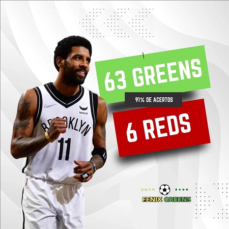
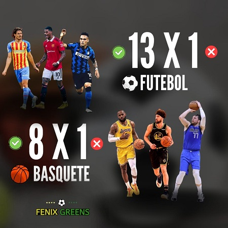
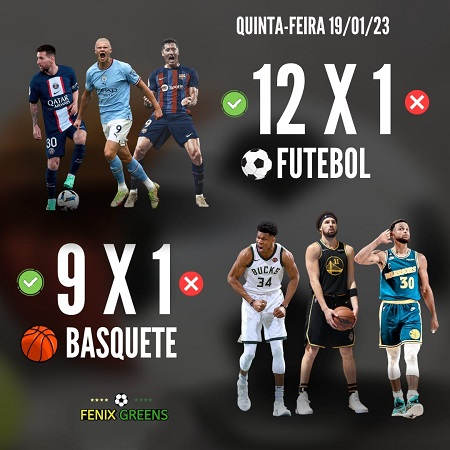

<!DOCTYPE html>
<html lang="en">
<head>
    <meta charset="UTF-8">
    <meta http-equiv="X-UA-Compatible" content="IE=edge">
    <meta name="viewport" content="width=device-width, initial-scale=1.0">
    <link rel="stylesheet" type="text/css" href="style.css">
    <link rel="shotcut icon" tyle="icon" href="./img/fenixgreens-logo.jpeg">
    <title>Fênix🦅⚽Greens</title>
</head>
<body>
    <header>
        
    </header>
    

        
        
        
        
        
        
        
        
    

</body>
</html>

*
{
    margin: 0;
    padding: 0;
    box-sizing: border-box;
}
body{
    display: flex ;
    justify-content: center;
    align-items: center;
    height: 100vh;
    background: url(./img/fenixgreens-logo.jpeg);
}
header{
    display: flex;
    margin: 12px;
    padding: 48px;
    background: black;
}
.logo{
    width: 75px;
    border-radius: 50%;
    float: right;
}

.box {
    position: relative;
    width: 200px;
    height: 200px;
    transform-style: preserve-3d;
    animation: animate 10s linear infinite;
}
@keyframes animate {
    0%
    {
        transform: perspective(1000px) rotateY(0deg);
    }
    100%
    {
        transform: perspective(1000px) rotateY(360deg);
    }
}
.box span {
    position: absolute;
    top: 0;
    left: 0;
    width: 100%;
    height: 100%;
    transform-origin: center;
    transform-style: preserve-3d;
    transform: rotateY(calc(var(--1) * 45deg)) translateZ(400px);
}
.box span img {
    position: absolute;
    top: 0;
    left: 0;
    width: 100%;
    height: 100%;
    object-fit: cover;
}

